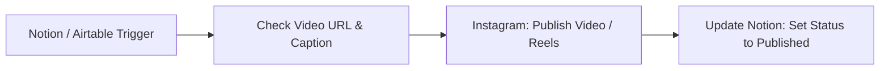

# Workflow Examples & Recipes

Here are common automation recipes and workflows you can build with n8n and this node.

---

## 1. Automated Instagram Comment Auto-Responder with AI

Automatically analyze comments on your recent posts using an LLM and reply with personalized responses.

### Steps:
1. Trigger on a schedule (e.g. every 15 minutes).
2. Fetch top 5 recent posts and their comments.
3. Use an LLM node to generate a friendly, context-aware reply.
4. Call **Instagram > Comment > Reply to Comment**.

---

## 2. Cross-Posting from Notion / Airtable to Instagram Reels

Publish videos stored in Notion or Airtable directly to Instagram Reels with status checking.

### Steps:
1. Trigger when a database record status changes to `Ready to Publish`.
2. Extract the public video asset URL and caption text.
3. Call **Instagram > Media > Publish Video** (with `Media Type: REELS`).
4. Update the Notion record with the newly generated Instagram Media ID.

---

## 3. Daily Analytics Digest to Slack / Telegram / Discord

Send a summary of yesterday's follower growth, reach, impressions, and top-performing post to your team's Slack channel every morning.

